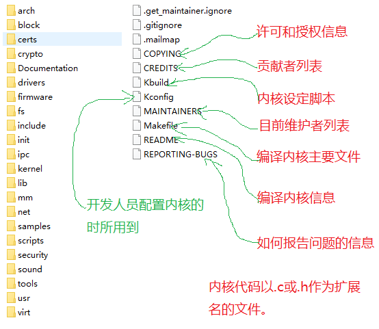

# Linux 内核源码组织结构

------------------

- [Linux 内核源码组织结构](#linux-内核源码组织结构)
  - [1. 版本信息](#1-版本信息)
  - [2. 目录结构](#2-目录结构)

## 1. 版本信息

------------------

- 内核版本：分两种
  - 1. 稳定版；
  - 2. 开发版；

- 内核版本的三组数字：
  - 1. 第一个数字： 发布内核的主版本号；
  - 2. 第二个数字： 偶数，表述稳定版本； 奇数表示研发版本；
  - 3. 第三个数字： 内核开发修改次数。

## 2. 目录结构

------------------

- arch目录： 不同平台体系相关代码；
- block目录： 块设备驱动；
- certs目录： 与认证和签名相关代码；
- cryto目录： 内核常用加密、压缩算法等代码；
- Documentation目录： 描述模块功能和协议规范代码；
- Drivers目录： 驱动程序（USB总线、PCI总线、显卡驱动等等）；
- fireware目录： 主要是一些二进制固件；
- fs目录： 虚拟文件系统代码；
- include目录：内核源码依赖绝大部分头文件；
- init目录： 内核初始化代码，联系到内存各组件入口；
- ipc目录： 进程间通信实现，比如共享内存、信号量、匿名管道等；
- kernel目录： 内核核心代码，包括进程管理、IRQ、时间等；
- lib目录： C标准库的子集；
- mm目录： 内存管理相关实现；
- net目录： 网络协议代码，比如TCP、IPv6、WIFI、以太网实现等等；
- samples目录： 内核实例代码；
- scripts目录： 编译和配置内核所需脚本：perl、bash；
- security目录： 内核安全模块相关代码，比如selinux；
- sound目录： 声卡驱动源码；
- tools目录： 与内核交互；
- usr目录： 用户打包和压缩内核的实现源码；
- virt目录： /kvm虚拟化目录相关支持实现。
