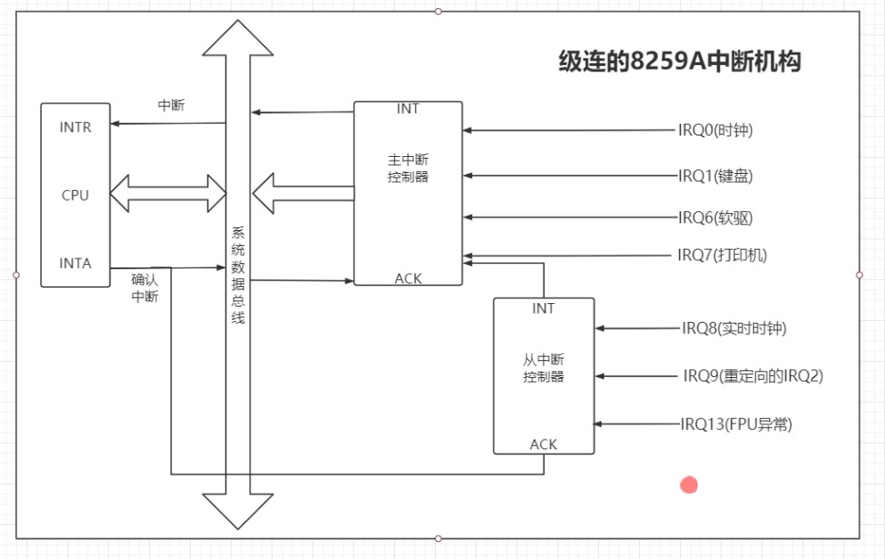

# 中断

-------------------

- [中断](#中断)
  - [1. 中断向量](#1-中断向量)
  - [2. 外设可屏蔽中断](#2-外设可屏蔽中断)
  - [3. 异常及非屏蔽中断](#3-异常及非屏蔽中断)
  - [4. 中断描述符表](#4-中断描述符表)

## 1. 中断向量

-------------------

  Intel x86 系列微机共支持 256 种向量中断， 为使处理器较容易地识别每种中断源， 将它们从 0-255 编号， 即赋予一个中断类型码 n， Intel 把这个 8 位的无符号整数叫做一个向量， 因此也叫中断向量。

  所有 256 种中断可分为两大类： 异常和中断。异常又分为故障和陷阱，它们的共同特点是既不使用中断控制器，也不能被屏蔽。中断又分为外部可屏蔽中断（INTR）和外部非屏蔽中断（NMI）， 所有 I/O 设备产生的中断请示（IRQ）均引起屏蔽中断， 而紧急的事件（硬件故障）引起的故障产生非屏蔽中断。

  非屏蔽中断的向量和异常的向量都是固定的，而屏蔽的中断的向量可以通过中断控制器的编程来改变。

  linux 对 256 个向量分配如下：

- 从 0-31 的向量对应于异常和非屏蔽中断；

- 从 32-47 的向量分配给屏蔽中断；

- 从 48-255 的向量用来标志软中断。 linux 只用其中一个（128或 0x80 向量）用来实现系统调用。当用户态的进程执行一条 ``` int 0x080 ``` 汇编指令， CPU 就切换到内核态，开始执行 ``` system_call() ``` 内核函数。

## 2. 外设可屏蔽中断

-------------------

  Intel x86 通过两片中断控制器 8259A 来相应 15 个外中断源，每个8259A 可管理 8 个中断源。第 1 级（称主片）的第 2 个 中断请示输入端， 与第 2 级 9258A （称从片）的中断输出端 INT 相连。通过图形描述如下：

  

  与中断控制器相连的每条线叫做中断线，要使用中断线，就是进行中断线的申请，就是 IRQ， 把申请一条中断线称为申请一个 IRQ 或者是申请一个中断号。 IRQ 线是从 0 开始顺序编号的。 因此，第一个IRQ 表示 IRQ0， IRQn 的缺省向量是 ``` n + 32 ```； IRQ 和向量之间的映射可以通过中断控制器端口进行修改。

  中断控制器 8259A 执行操作：

- 1.监视中断线，检查产生的中断请求（IRQ）信号；

- 2.如果在中断线上产生了一个中断请求信号：

  - a.把接收到的 IRQ 信号转换成一个对应的向量；

  - b.把这个向量存放在中断控制器的一个 I/O 端口，从而允许 CPU 通过数据总线读此向量；

  - c.把产生的信号发送到 CPU 的 INTR 引脚 ---- 即发出一个中断操作；

  - d.等待，直到 CPU 确认这个中断信号，然后把他写进可编程中断控制器（PIC）的一个 I/O 端口；此时，清 INTR 线。

- 3.返回到第一步。

## 3. 异常及非屏蔽中断

-------------------

  异常就是 CPU 内部出现的中断，也就是说，在 CPU 执行特定指令时出现的非法情况。 非屏蔽中断就是计算机内部硬件出错时引起的异常情况。

## 4. 中断描述符表

-------------------

  在实地址模式中， CPU 把内存中从 0 开始的 1K 字节作为一个中断向量表。 表中的每个表项占 4 个字节， 由两个字段的段地址和两个字节的偏移量组成，这样构成的地址便是相应中断处理程序的入口地址。
  在实模式下，中断向量表中的表项由 8 个字节表示，中断向量表也改叫做中断描述符表 IDT， 其中的每个表项叫做一个门描述符， “门” 的函含义就是当中断发生时，必须通过这些门， 然后才能够进入相应的处理程序。

  其中类型占 3 位， 表示门描述符的类型：

- 1.任务门 （task gate）

  类型编码 101， 包含一个进程 tss 段的选择符，偏移部分没有使用，tss 本身被作为一个段对待， 所以不包含某个入口函数地址。

- 2.中断门 （interrupt gate）

  包含一个中断或异常处理程序的所在段的选择符，段内偏移量。当控制权进入中断门进入中断处理程序。

- 3.陷阱门 （trap gate）

  和中断门一样，但是控制权通过陷阱门时，不关闭中断。

- 4.系统门 （system gate）

  内核特别设置，DPL 为 3， 让用户态进程访问 linux 异常处理程序进入系统调用。
